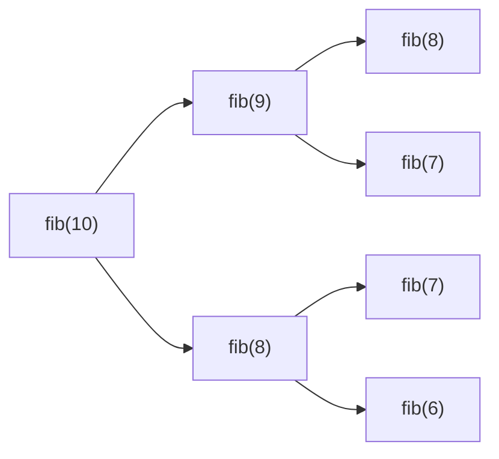

#                        初识动态规划

#### 动态规划理论理解：

动态规划算法:将复杂问题分解成相对简单的子问题,子问题通常是当前问题前一个状态的问题,通常初始问题的解是较为容易得到的,后面的问题的解由他前面状态子问题的解推导而来,动态规划算法的核心难点在于将复杂问题分解成简单问题的这个过程,即找到当前状态解与前一个状态的解的关系,即找状态转移方程的过程,因为他并没有类似广度优先算法(BFS)或是深度优先算法(DFS)等等算法的固定模板,而是要具体问题具体分析所以我觉得是算法问题里面较难的一类问题。

#### 举个例子

动态规划问题的经典例子:斐波那契数列第n项的值。

斐波那契数列:一个整数数列,满足第n项的值等于第n-1项和第n-2项的和 n>=2.第一项值为0第二项值为1.

大家会很简单想到递归算法:

~~~java
 public int fib(int n) {
    	  if(n == 0)
    		  return 0;
    	  if(n == 1) {
    		  return 1;
    	  }
    	  return fib(n-1)+fib(n-2);  
      }
~~~

递归算法的问题：存在大量重复运算占内存,n值过大时栈内存会超出报异常。

简单解释下重复运算在哪,首先假如我要求第10项 ,fib[8]和fib[7]就被重复计算了越往下递归重复计算的越多。

其实这题状态转移方程我们已经知道了即fib(n)=fib(n-1)+fib(n-2) n>=2,所以我们只需要将前两项的值缓存起来就可以很快的得到当前项的值,这个缓存一般用一个数组dp,dp[n]表示斐波那契数列第n项的值,一定要弄清楚这个数组索引的含义,后期这个数组可能是二维的,只有弄清楚了这个索引的含义解题思路才不会混乱.于是代码变成了如下。

动态规划算法:

~~~java
public int fib(int n) {
    	  if(n==0)
    		  return 0;
    	  if(n==1)
    		  return 1;
    	  //数组长度为什么是n+1因为数组索引从0开始要取第n项,长度得是n+1
    	  int dp[] = new int[n+1]; 
    	  //初始化
    	  dp[0] = 0;
    	  dp[1] = 1;
    	  for(int i = 2;i<=n;i++) {
    		  //从第三项开始推导
    		  dp[i] = dp[i-1]+dp[i-2];
    	  }
    	  return dp[n];
      }
~~~

#### 结语

最后再引用quora(外国知乎)上一个高赞答案对于动态规划的理解:

先在一张纸上写1+1+1+1+1+1+1+1 = ?结果是啥。

哦，数一数。。。8！！！

然后再再左边加个1呢?

9!!!，

为什么这次这么快？

你就在8的基础上加了1嘛.哦,原来动态规划算法只是用一个看似酷炫的方法记住了之前的结果避免了重复计算。

至此,想必大家已经对动态规划算法已经有了个基本的概念,但是概念始终是概念,程序员得在实码中去体会动态规划的魅力以及提高自己的水平和能力毕竟talk is cheap,show me  the code!

